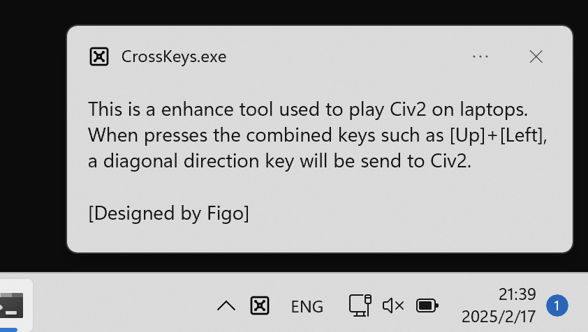

# CrossKeys
I'm an avid fan of the game Civ2. As computers keep getting upgraded, it's becoming increasingly difficult to play Civ2 (fortunately, I've always managed to overcome various issues). However, on laptops, keyboard problems can be really annoying. CrossKeys is a small tool that enhances the laptop keyboard. It's designed specifically for the Civ2 game. It uses the four arrow keys (up, down, left, right) to simulate the diagonal keys on the numeric keypad, enabling laptops without a numeric keypad to control Civ2 as well (for Civ2, diagonal keys are essential). I hope this open - source software can help all Civ2 enthusiasts. Just enjoy it! 

Currently, this tool only supports the combination of the up, down, left, and right keys corresponding to the four keys Numpad7, Numpad9, Numpad1, and Numpad3. In Civilization 2, these keys are used for diagonal movement. To avoid interfering with the original functions of the up, down, left, and right keys, a time threshold for simultaneous key - presses has been set in the software: DWORD g_KeyInterval; Its default value is 100ms. That is to say, two keys pressed within 100ms will be regarded as a combined key, and if the time exceeds this limit, they will be regarded as two independent key - press events.

I tried it out, and it performed perfectly. 

To enhance the user experience, when a combination key is pressed, the Trayicon will show a corresponding red icon prompt, just as shown in the picture.

CrossKeys.exe is compiled using DEV C++ 5.11. Since it doesn't utilize any special APIs, it should also be compilable with other versions of the GCC compiler. I recommend compiling it in 32-bit mode, so that it can work properly on both 32-bit and 64-bit systems. 
